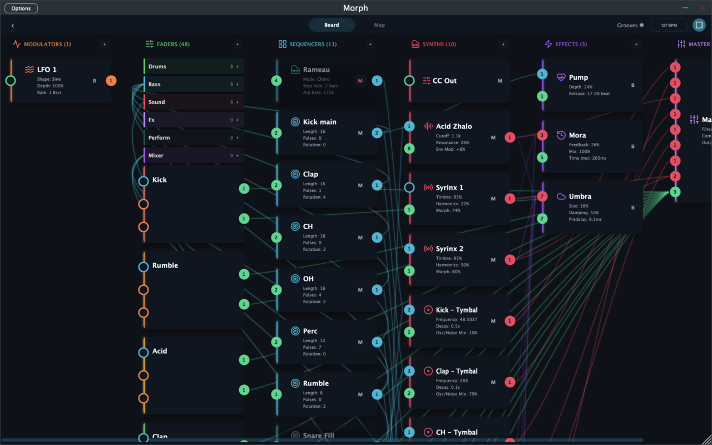
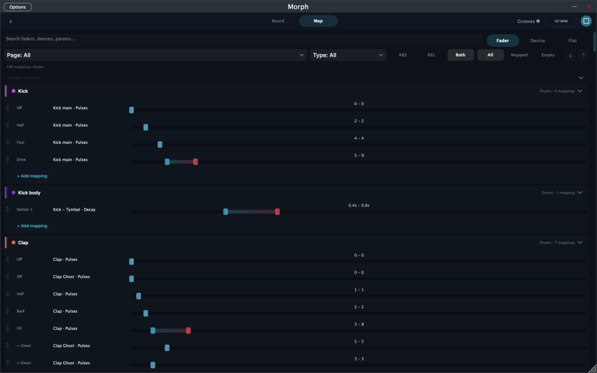

# The Board & Routing

The **Board** is Morph's patch bay — the view where you see every device in the kit and rewire how they connect. Open it with the **circuit-board icon** in the top-right rail; the **‹** button in its top-left corner takes you back to the stage.

---

## Reading the Board

Devices sit in six columns, following the signal flow left to right:

| Column | What lives there |
|--------|------------------|
| **Modulators** | LFOs, Envelopes, Gyroscope axes |
| **Faders** | All your pages of faders (collapsible per page), plus the fixed FX and Mixer pages |
| **Sequencers** | Euclid, Trigger, Turing, Rameau |
| **Synths** | Syrinx, Zhalo, Drone, Bandura, Tymbal, MIDI Out, CC Out |
| **Effects** | Mora (delay), Umbra (reverb), Pump (sidechain) |
| **Master** | The master FX chain and output |

Each device card shows its name and a live summary of key parameters. The small round **ports** on a card's edges are its connection points, and the colored lines between them are the kit's wiring:

- **Cyan** — MIDI (sequencer → synth)
- **Pink** — audio (synth → master mixer)
- **Orange** — modulation (LFO/Envelope/Gyro → fader)
- **Green** — control (fader → device parameter)

Pinch (iOS) or use your trackpad to zoom from 50% to 250%; columns collapse to slim rails when you need an overview. The top bar mirrors the transport and BPM, and shows the kit name (with a ✱ when unsaved).

---

## Tap to Connect

Wiring is two taps: **tap a source port, then tap a destination.**

When you tap a port, the Board enters connect mode — compatible targets light up, incompatible cards dim:

Tap a highlighted port to complete the connection; tap empty space to cancel. The same flow wires everything:

- a sequencer's MIDI out → a synth's MIDI in
- an LFO → a fader (then set depth per target)
- a fader → a device parameter (then choose which parameter and range)

Tapping an existing connection's port lets you remove or modify it.

---

## Managing devices

Each column header has a **+** button to add a device of that type — pick from the menu (Add Synth, Add Sequencer, …). Tap any device card to open its editing sheet, where the header gives you:

- **Rename** — tap the name
- **Preset picker** — factory / user / kit presets, with Save As, Update, Rename, Delete
- **Mute**, **Duplicate**, **Delete**, **Close**

Effects and the Master are permanent singletons — every kit has exactly one Mora, Umbra, Pump, and Master.

---

## Managing faders and pages

The **Faders column** is also where you build your control surface. Each page is a collapsible section with its own menu:

- **Add item** — Standard Fader, XY Fader, Range Fader, or Spacer
- **+ New Page** — add a page (you can also use the virtual "+" tab on the stage)
- Rename, recolor, and delete pages

Spacers are invisible layout blocks for grouping faders visually. The Mixer page (and its faders) is permanent and can't be deleted.

---

## Fader mapping: ABS and REL

Tap a fader card (on the Board, or via its config button in stage edit mode) to open its configuration sheet:

A fader maps to one or more device parameters. For each mapping you choose a parameter, a **range** (the slice of the parameter the fader covers — it can be inverted), and a mode:

- **ABS (absolute)** — the fader *owns* the parameter: fader position maps directly onto the chosen range. One ABS owner per parameter.
- **REL (relative)** — the fader *offsets* the parameter around its base value, by a configurable ± percentage of the range. Several REL faders can stack on the same parameter, and REL faders ride on top of whatever the ABS owner (or the device's own setting) says.

ABS is for "this fader is the filter knob." REL is for "this fader adds ±20% wobble to wherever the filter already is." Modulators always work REL-style on top.

Standard faders can add **sections** here too — split the travel into slices, each with its own mappings and label. The zone names you see on factory faders ("Off / Half / Four / Drive") are section labels.

The sheet also sets the fader's label, color, and **response curve** (how travel maps to values).

---

## The Map tab

Next to "Board" at the top is **Map** — a flat, searchable list of every mapping in the kit:

Filter by page, fader type, ABS/REL, or mapped/empty; search by fader, device, or parameter name; and edit ranges inline with the dual-thumb sliders. When a kit has grown to dozens of faders and hundreds of mappings, this is the fastest way to audit "what controls what."
