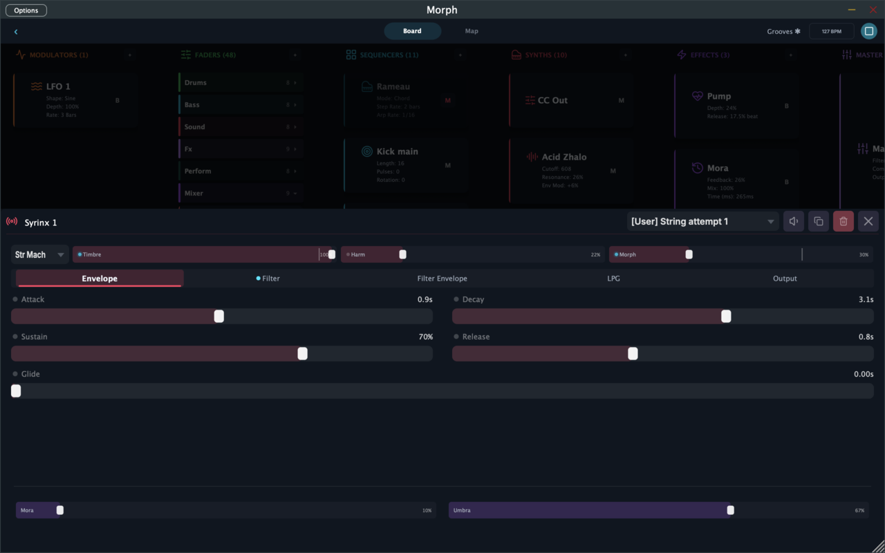

# Sounds & Modulators

Every sound in Morph comes from a **device**. Kits combine synths, sequencers, modulators, and effects into a playable instrument — this page covers the sound sources and the modulators. (Sequencers and effects have their own pages.)

You meet devices on the [Board](board.md): tap any device card to open its editing sheet, with quick-access macro sliders up top, tabbed parameter groups below, and a preset picker in the header.

Each synth device also has its own **preset library** — factory presets plus your own. The picker in the sheet header lets you save, update, rename, and delete presets independently of the kit.

---

## Synths

Kits can hold up to 16 sound devices, freely mixed from these six types. Names in parentheses are how they appear on the Board.

### Syrinx — the macro synth

The Swiss-army knife. Syrinx is built on Mutable Instruments' Plaits oscillator and packs **24 synthesis engines** into one device: virtual analog, FM (2-operator and three 6-operator variants), wavetable, additive, formant/speech, chords, swarm, particle, Karplus-Strong and modal physical modeling, plus dedicated bass drum, snare, and hi-hat engines.

Whatever the engine, you shape it with the same four macros — **Engine, Harmonics, Timbre, Morph** — plus a multimode filter, filter envelope, amp envelope, and an optional low-pass-gate mode for plucky, organic decays. It's paraphonic, so it plays chords from the chord sequencer happily.

If a kit needs "a sound," it's usually a Syrinx.

### Zhalo — the acid synth

A faithful TB-303 voice (built on the Open303 engine): one oscillator blending saw and square, a screaming resonant filter with envelope modulation, accent, and slide. Sequence it with slides and accents and you get instant acid. A built-in distortion stage (Drive/Tone) takes it from rubbery to nasty.

### Drone — the atmosphere machine

Three detuned oscillators that morph continuously from sine through triangle and saw to square, plus a sub. A fixed-routing LFO slowly works the filter and pitch, a second "texture" LFO runs at a polyrhythmic ratio of the first, and pitch drift keeps everything slightly alive. Inspired by instruments like the Soma Lyra-8: set it, let it evolve, ride the filter.

### Bandura — the deep drone

Drone's wilder sibling. Same three-oscillator + sub core, but with **two morphing LFOs** whose destinations themselves morph (filter ↔ pitch ↔ tremolo ↔ FM on one; stereo ↔ detune ↔ waveform ↔ feedback on the other), LFO cross-modulation, filter input drive, and separate low-pass and high-pass cutoffs. More chaotic, more organic, harder to predict — in a good way.

### Tymbal — the drum synth

A percussion voice: a tunable oscillator with pitch envelope and pitch LFO, a noise section with its own filter and envelope, and a distortion output. Covers kicks, snares, toms, hats, claps, and stranger metallic percussion. Kits typically run several Tymbals — one per drum voice — each driven by its own sequencer.

### MIDI Out

Not a sound at all: a device that forwards whatever MIDI reaches it to an external MIDI output and channel. Point a sequencer at a MIDI Out and Morph plays your hardware synth or another plugin. See [MIDI](midi.md).

---

## Modulators

Modulators are devices that move **faders** automatically. That's an important Morph idea: modulation targets the fader, not the synth parameter directly — so an LFO wobbles the same fader you'd move by hand, complete with the on-screen animation, and everything the fader is mapped to follows. Your hands, motion recordings, and modulators all speak the same language.

Each modulator has a target list — which faders it drives and how deeply (depth can be negative to invert). You wire targets on the [Board](board.md) by connecting the modulator's port to a fader.

### LFO

A classic low-frequency oscillator with five shapes: **sine, triangle, saw, square, and random** (sample & hold). It runs either **synced** to the tempo (musical divisions, e.g. "3 bars") or **free** at a rate in Hz. Depth, phase offset, and **unipolar/bipolar** polarity round it out.

Slow sine on a filter fader = automatic sweeps. Fast random on a timbre fader = motion texture. Square on a volume fader = trance gate.

### Envelope

An Attack–Hold–Decay envelope that fires when a sequencer sends it a note. Route a kick sequencer into an Envelope, point the Envelope at a reverb-size fader, and the reverb breathes with every kick. Retrigger on or off.

### Gyroscope *(iOS)*

Tilt your device, move a fader. Each Gyroscope device reads one motion axis with smoothing, sensitivity, polarity, and invert controls. Map pitch tilt to a filter and roll to delay feedback, and the whole instrument becomes physical.

---

## Other devices you'll see on the Board

- **CC Out** — turns fader moves into outgoing MIDI CC messages for external gear. See [MIDI](midi.md).
- **Mora (delay), Umbra (reverb), Pump (sidechain), Master** — the effects section, covered in [Effects & Mixing](effects.md).
