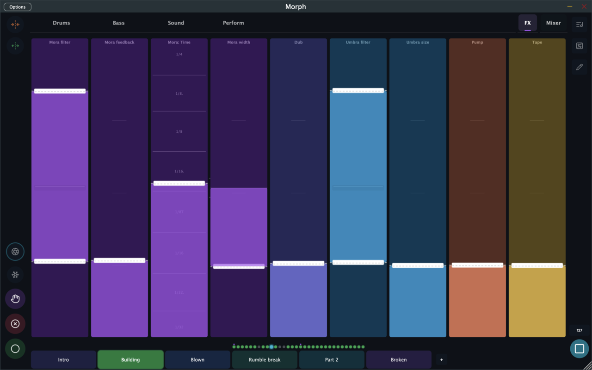

# Effects & Mixing

Morph's effects section is fixed and always on: two send effects (delay and reverb), a sidechain pump, and a master chain with filter, tape saturation, compression, and limiting. Every kit has exactly one of each — what changes is how hard you drive them.

You'll usually play the effects from the **FX page** (the fixed tab next to Mixer):

…and balance levels on the **Mixer page**:

---

## The Mixer

Eight channel strips — one per synth slot — plus a master strip with live metering. Each strip is an XY fader:

- **Vertical** — channel volume
- **Horizontal** — pan

Mixer faders record motion like any other fader, so fades and pans can be part of the loop. The mixer lives in the **Master** device, after the master filter, so the DJ filter sweeps the whole mix.

---

## Mora — the delay

A tempo-synced send delay in the spirit of classic groovebox delays:

- **Time** — synced musical divisions (or free milliseconds)
- **Feedback** — from slapback to near-infinite
- **LPF / HPF** — darken or thin out the repeats
- **Ping Pong & Width** — stereo behavior
- **Reverb Send** — feeds the delay's output *into* the reverb for washed-out dub tails ("Dub" on factory FX pages)

Every synth has its own send level into Mora, so the snare can swim while the kick stays dry.

## Umbra — the reverb

A send reverb shaped Digitakt-style with high-pass and low-pass filters instead of fiddly EQ:

- **Size** — room to cavern
- **Damping** — how fast highs die in the tail
- **Predelay** — separation between dry hit and tail
- **LPF / HPF** — tame boom or fizz
- **Mix** — return level

Per-synth sends here too. And because Mora can feed Umbra, delay repeats can bloom into reverb.

## Pump — the sidechain

The "everything ducks to the kick" effect, without routing headaches. Pump listens to MIDI from any sequencer (usually the kick's) and ducks the mix on every hit:

- **Intensity** — how deep the duck goes
- **Shape** — Punch, Smooth, Breathe, or Ramp envelopes
- **Attack / Hold / Release** — timing, with release measured relative to the beat so it scales with tempo
- **Kick Thru** — on: mixer slot 1 (your kick) is excluded, classic sidechain; off: everything pumps, Digitakt-style

## Master — the output chain

The final processing stage, in a fixed order:

1. **DJ Filter** — one sweep control: center is neutral, down is low-pass, up is high-pass. The classic transition move.
2. **Mixer** — the 8 channel strips above
3. **Tape** — tape saturation (drive, head bump, flutter) for glue and warmth
4. **Compression** — threshold, speed, and mix (parallel compression built in)
5. **Pump** — applied here, post-compression
6. **Limiter** — always on, keeps the output clean
7. **Output level**

A small but useful switch: **FX Order** flips Tape and Compression (saturate-then-compress vs compress-then-saturate). The tape and compressor stages are built on well-loved Airwindows DSP.

---

## Playing the effects

Because every one of these parameters is fader-mappable, effects in Morph are performance instruments:

- Map **Mora feedback** to a fader, record a slow rise into a scene switch — instant transition.
- Put **DJ Filter** on a fader (factory kits do) and mix scenes like a DJ set.
- Map an **Envelope modulator** (triggered by the kick) to the Umbra size fader for breathing space.
- Ride **Pump intensity** between sections to change how hard the track leans on the kick.
