# Morph: The Full Guide

Morph is a music-making app built around one idea: **record your hands, play them back**. You move faders, Morph remembers the movements, and they loop in time. Stack layers, build patterns, shape sounds — all by touch.

This guide walks through the performance screen in order, from "how do I make sound" to "how do I wire everything together." For the deeper layers — devices, sequencers, routing — see the dedicated pages in the sidebar.

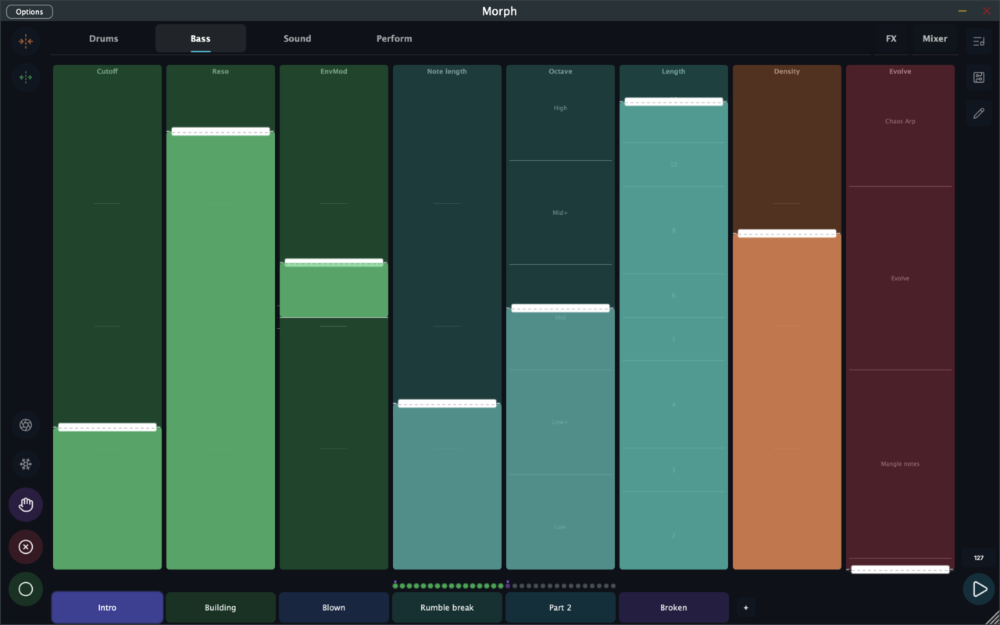

---

## The Screen at a Glance

- **Top:** page tabs (your fader pages), plus fixed **FX** and **Mixer** tabs on the right
- **Top-right rail:** Kits browser, Board view, Edit mode buttons
- **Left rail:** loop-length buttons (top), then Time Jump, Freeze, HOLD, CLEAR, REC
- **Bottom-right:** tempo button (shows current BPM) and Play
- **Center:** the fader grid
- **Below the faders:** the step indicator (one dot per 16th-note step)
- **Bottom:** the scene strip

---

## Kits

A **kit** is a complete snapshot of everything in Morph — sounds, fader layouts, pages, patterns, scenes. Loading a kit gives you a whole new instrument.

Tap the **Kits button** (list icon, top-right) to open the kit browser. From there you can search, filter by **Factory** or **My Kits**, and tap any kit to load it. Your current kit shows an orange **edited** dot when it has unsaved changes, along with **Save** / **Save As** buttons.

Factory kits are read-only — saving one creates your own copy in My Kits.

See [Kits & Settings](kits-settings.md) for the full tour, including import/export.

---

## Transport and BPM

The **Play** button (bottom-right) starts and stops the clock. When the transport is running, sequencers fire, motion recordings play back, and everything moves in sync.

The **tempo button** next to it shows the current BPM. Tap it to open the tempo dialog:

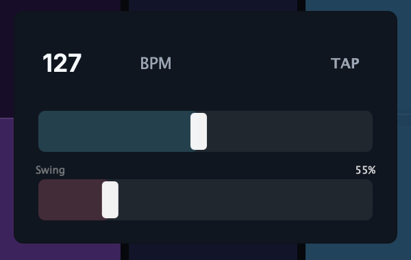

- **BPM slider** — set the tempo directly
- **TAP** — tap in time to set the tempo
- **Swing** — 50% is straight; up to 75% shifts off-beat 16ths late for groove

When Morph runs as a plugin inside a DAW, tempo syncs to the host. Internally Morph runs at 192 PPQN, so timing is precise down to tiny fractions of a beat.

---

## Faders: Your Main Control Surface

Faders are the vertical sliders that fill the main screen. Each one is mapped to a parameter — a synth's filter cutoff, a sequencer's density, a reverb amount, whatever the kit designer chose. Many faders are split into labeled **zones** (like "Off / Half / Four / Drive" on a kick fader) so one slider can move through distinct behaviors.

**Drag a fader up or down to change its value.** That's it.

A thin dashed white line on each fader marks its **saved position** — the value it returns to when motion playback has nothing recorded. This is your reference point.

Small icons in a fader's header tell you its state:

- **Green dot** — this fader has a recorded motion loop
- **Camera icon** — a Time Jump gesture is waiting in the buffer (see below)

---

## REC, HOLD, CLEAR

These three buttons on the left rail change what touching a fader does. By default they work in **Latch** mode: tap once to activate, tap again to deactivate — no need to hold.

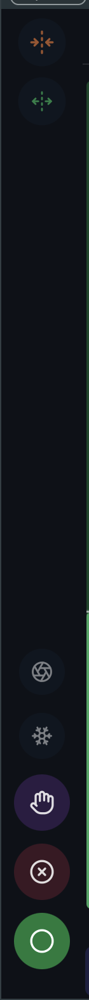

> The rail from top to bottom: **halve loop** (orange collapse arrows), **double loop** (green expand arrows), **Time Jump** (camera shutter), **Freeze** (snowflake), **HOLD** (hand), **CLEAR** (⊗), **REC** (circle).

Moving a fader normally updates its saved position — the fader stays wherever you leave it, like a physical knob you turn and leave alone.

### REC — Record movements

Activate **REC**, then touch faders. Every movement is recorded into the loop in real time. Deactivate REC to stop recording.

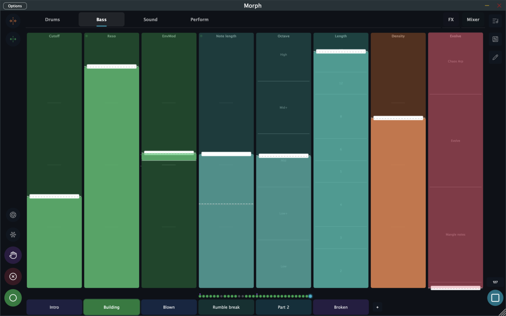

The recording loops in sync with the transport. The next time through, Morph plays back exactly what you did. Faders with recordings get a green dot, and the step indicator fills in where your movements landed.

### CLEAR — Erase a fader's recording

Activate **CLEAR**, then tap or drag a fader. Its motion recording is erased and the fader sticks to wherever you touched it.

### HOLD — Play without committing

Activate **HOLD** to temporarily suspend position saving. While HOLD is on, moving a fader does not update its saved position — useful for auditioning a value without locking it in. Deactivate HOLD and the fader snaps back to its last saved position.

> **Two control schemes.** The Settings screen has a **Fader Control** switch with two modes. **Build** (the default, described above): faders stay where you put them, HOLD is the temporary exception. **Play**: the reverse — faders spring back to their saved position when you let go, and HOLD commits a new position. Play mode is designed for live performance: push a fader for emphasis, release to return.

> **Momentary mode.** The **Button Mode** setting switches REC/HOLD/CLEAR from Latch to Momentary — active only while physically held. To latch a button in Momentary mode, press it and drag your finger away before releasing.

---

## The Step Indicator

The **step indicator** is the row of small dots between the fader grid and the scene strip. Each dot is one 16th-note step of the loop.

- **Filled dot** — at least one fader has a recorded movement at this step
- **Empty dot** — nothing recorded here
- **Highlighted dot** — the current playback position

This gives you a bird's-eye view of where your recordings live. Sparse dots mean a spacious pattern; dense dots mean lots of activity.

---

## Extending and Shrinking the Loop

The two buttons at the top of the left rail change the loop length:

- **Halve** (orange collapse arrows) — cuts the loop in half. Data beyond the new endpoint is discarded.
- **Double** (green expand arrows) — short press doubles the loop length, keeping existing data and adding empty space. **Long press** doubles the loop and clears the newly exposed half.

Use these to change the feel fast: halving creates tight, repetitive patterns; doubling gives you room to build a longer arc. Loop length is measured in 16th-note steps (8, 16, 32, or 64).

---

## Freeze and Time Jump

These two buttons give you precise control over motion playback.

### Freeze

**Freeze** lets you lock individual faders in place while everything else keeps moving. Tap the side **Freeze** button (snowflake) to enter freeze mode — a small snowflake button appears in the top-left corner of every fader. Tap a fader's snowflake to freeze just that fader at its current value; tap it again to unfreeze. Frozen faders hold their position and ignore motion and modulation, while the transport, sequencers, and all unfrozen faders keep running.

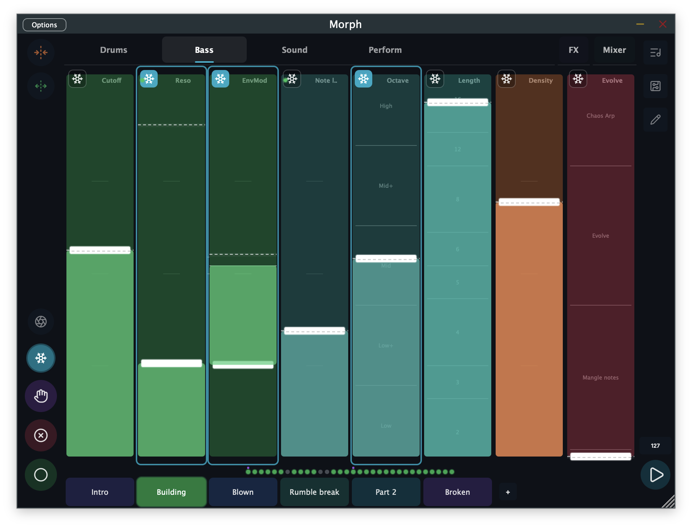

It's the DJ move: hold a filter where it is while the beat plays on. Tap the side Freeze button again to unfreeze everything at once, or **long-press it** to commit the frozen values as the faders' new saved positions.

### Time Jump

**Time Jump** (camera shutter icon) is retroactive capture. Morph is always silently recording your fader movements into a short background buffer. Tap Time Jump and Morph reaches back in time and commits your last gesture into the loop — as if you'd hit REC just before you started moving.

The button glows cyan when there's a capturable gesture waiting, and faders with pending gestures show a small camera icon in their header.

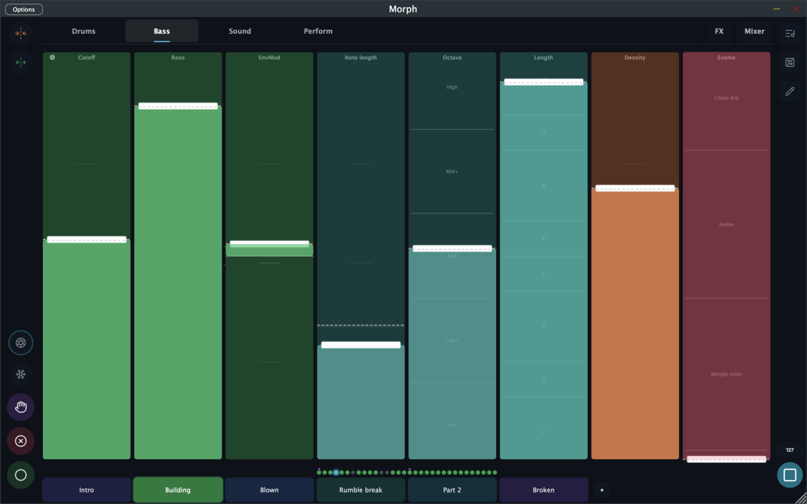

**Long-press Time Jump** to undo the last capture.

This is one of Morph's most powerful performance features: play freely, then keep the moments you liked.

---

## Scenes

A **scene** is a snapshot of all your fader positions and motion recordings. Switching scenes swaps the entire state of the fader grid in one move — different positions, different recorded movements — while the sounds, routing, and device settings stay the same.

Think of scenes as sections of a track: intro, build, drop, breakdown. Switching between them live is how you create arrangement on the fly.

The **scene strip** runs along the bottom of the screen. The active scene is highlighted; scroll horizontally if you have more than fit on screen.

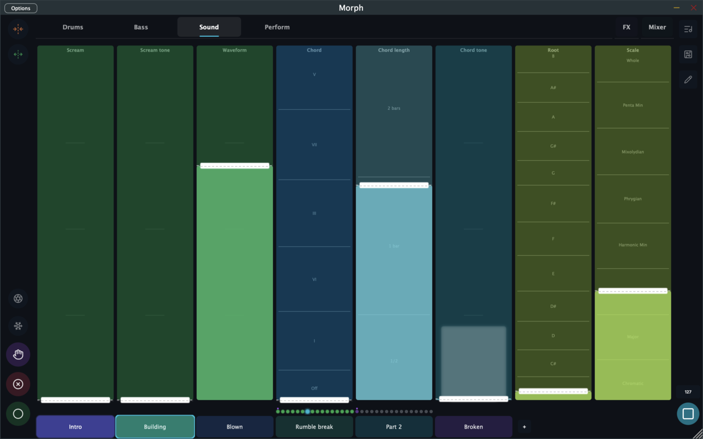

### Adding a scene

Tap **`+`** at the end of the scene strip. Morph duplicates the current scene — copying all saved fader positions and motion recordings — and switches to it. From there, record different movements to make it its own thing.

### Switching scenes

Tap any scene button to switch. While the transport is stopped, the switch is instant. While playing, the switch lands on the next musical boundary set by the **Scene Switch** setting — the queued scene glows cyan until the boundary arrives:

| Scene Switch setting | When the switch lands |
|--------|------------------------|
| Next 16th | Next 16th note (feels immediate) |
| Next Beat | Next quarter note |
| Next Bar | Next bar line |
| Next 2 Bars | Next 2-bar boundary |
| Next 4 Bars | Next 4-bar boundary |
| End of Pattern | When the current loop wraps around |

You'll find the setting on the [Kits & Settings](kits-settings.md) screen. With longer quantization you can queue a switch early and let it land exactly on the drop.

### Editing scenes

Tap the **Edit button** (pencil, top-right rail — glows orange when active). In edit mode:

- A **delete button** appears on each scene. You can't delete the last one.
- **Long-press** a scene to rename it.
- **Drag** a scene to reorder it.

Tap the pencil again to exit.

---

## Pages of Faders

A **page** is a named group of faders. Instead of cramming every fader onto one screen, kits organize them across pages — "Drums", "Bass", "Sound", "Perform", and so on.

Tabs at the top of the screen switch pages (on iOS you can also swipe left/right). Two special tabs sit on the right:

- **Mixer** — always present: 8 channel strips (one per synth) plus a master strip. Each strip is an XY fader — vertical for volume, horizontal for pan — with live level meters.
- **FX** — appears when the kit has a page named "FX": faders for the global effects (delay, reverb, pump, tape, and the DJ filter).

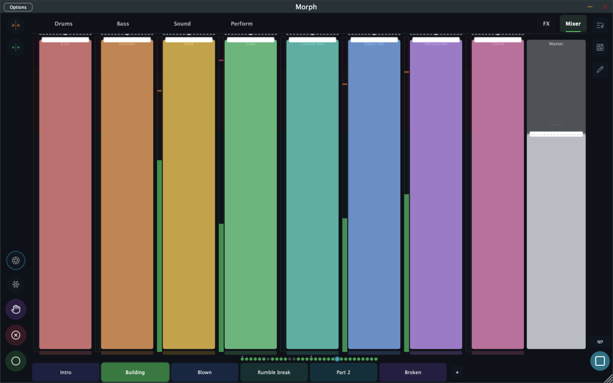

See [Effects & Mixing](effects.md) for what the FX faders do.

---

## Fader Types

Morph has three fader types, plus spacers for layout. They all record and play back motion the same way.

### Standard Fader

A single vertical slider mapped to one or more parameters. A standard fader can be split into **sections** — each slice of the travel controls a different parameter or behavior, with labeled zones. That's how one "Kick" fader can go from off, to a four-on-the-floor, to a driven, pitched-up pattern as you push it up.

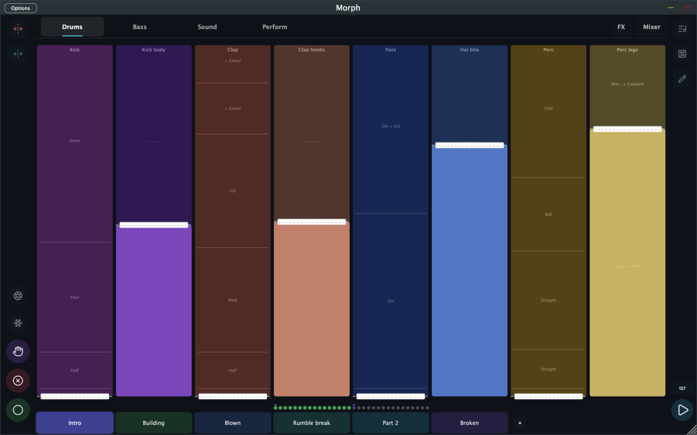

### XY Fader (2D Pad)

Two axes in one touch surface: drag vertically for Y, horizontally for X. Given more width, it becomes a full 2D pad with a crosshair. Both axes record and play back independently. A configurable center **dead zone** helps you hold center without drifting.

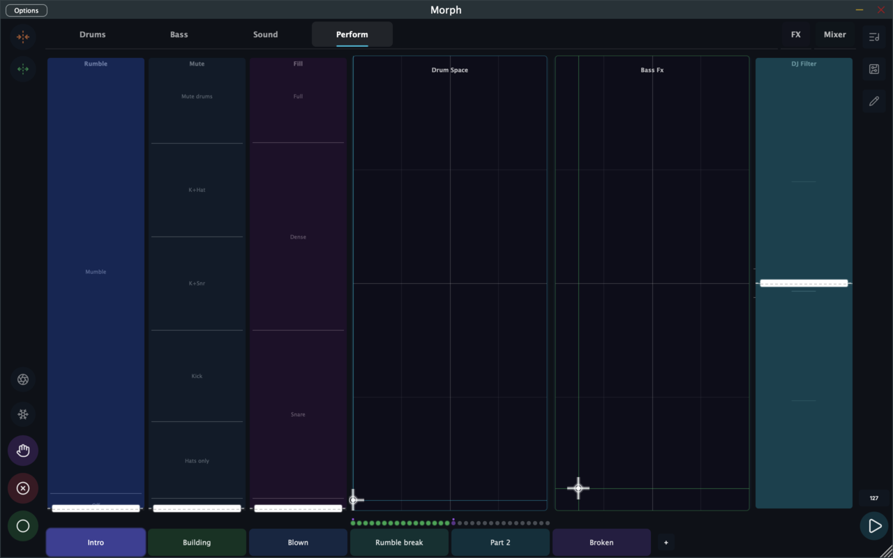

### Range Fader

Two thumbs on one vertical track — a low handle and a high handle. The filled band between them is the active range: drag the band to move both, drag a thumb to resize. Useful for things like a filter's low/high band or constrained randomization ranges.

Faders can also map to musical choices, not just amounts — root note, scale, chord — with labeled notches for each option:

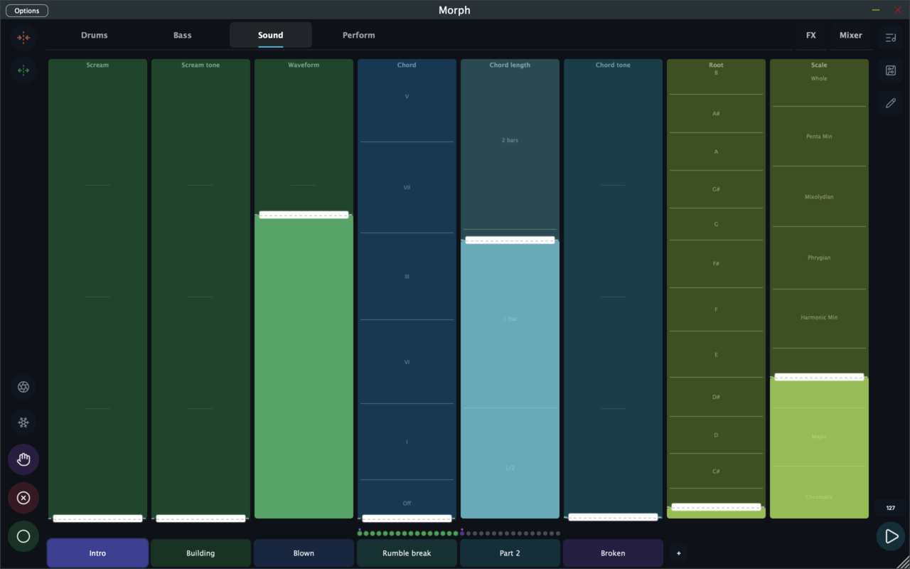

To create or reconfigure faders, see [The Board & Routing](board.md).

---

## Editing Faders on the Stage

Tap the **pencil** in the right rail to enter edit mode. Every fader grows a drag handle (for reordering, including across pages) and a small config button that opens the fader's settings sheet — its label, color, response curve, device mappings, and sections.

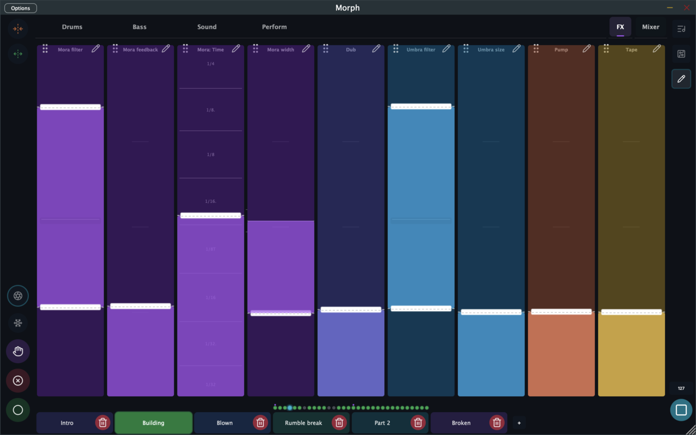

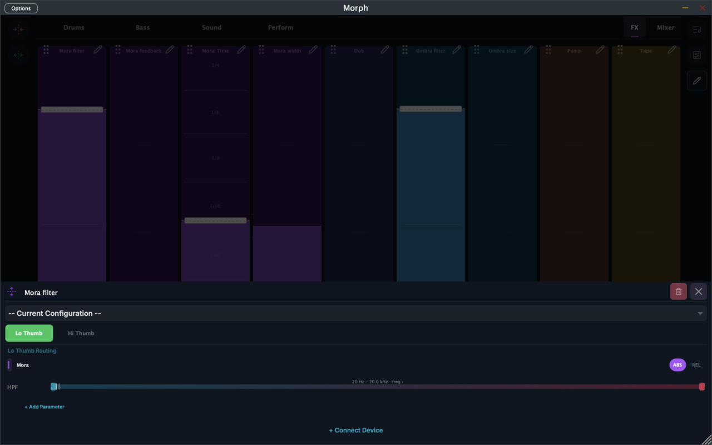

The full mapping system — what ABS/REL means, adding parameters, connecting devices — is covered in [The Board & Routing](board.md).

---

## The Waveform Scope

Settings has a **Waveform** toggle that overlays a live waveform visualization across the whole stage — handy for video recordings and simply for seeing what you're hearing.

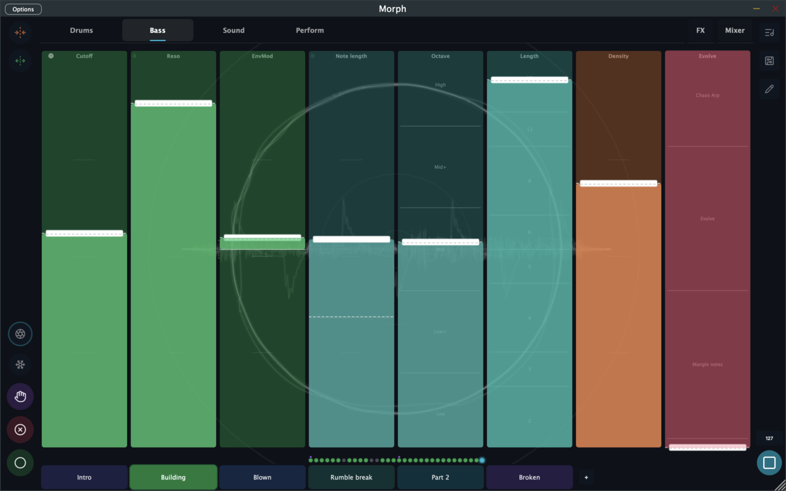

There's also **Note Pulse** (on by default): faders flash softly when the sequencer routed to them fires a note, so you can see the rhythm in the fader grid.

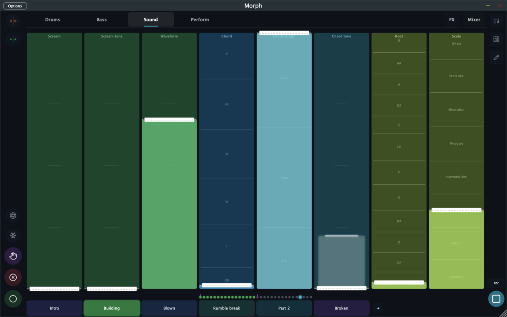

---

## Video Jam Recording *(iOS only)*

On iOS, the **camera button** arms video recording. When you press play, Morph records a video of your fader grid along with the audio — ready for TikTok, Reels, or Shorts. When the transport stops, the video saves to your Photos library.

Settings includes **Video Orientation** (vertical or horizontal) and a **Video Background** (light/dark) option.

---

## The Board

The **Board** (circuit icon, top-right rail) is the view behind the curtain: every device in the kit and how they connect.

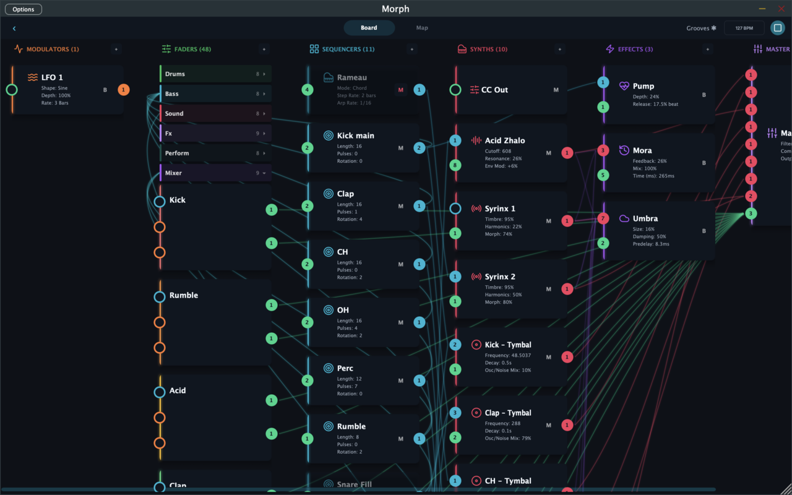

Devices flow left to right — **Modulators → Faders → Sequencers → Synths → Effects → Master** — with colored lines showing connections: cyan for MIDI, pink for audio, orange for modulation, green for fader control.

This is where you build the architecture of a kit: which sequencer triggers which synth, which LFO moves which fader, how effects are fed. It gets its own page: [The Board & Routing](board.md).

---

## Where to Go Next

- **[Sounds & Modulators](devices.md)** — the six synth types and the LFO/Envelope/Gyroscope modulators
- **[Sequencers](sequencers.md)** — Euclid, Trigger, Turing, and the Rameau chord engine
- **[The Board & Routing](board.md)** — wiring, fader mapping, ABS/REL
- **[Effects & Mixing](effects.md)** — delay, reverb, sidechain pump, and the master chain
- **[MIDI](midi.md)** — external controllers, MIDI learn, and driving hardware from Morph

The best way to learn is still the simplest: open a factory kit, press play, and start touching things.
