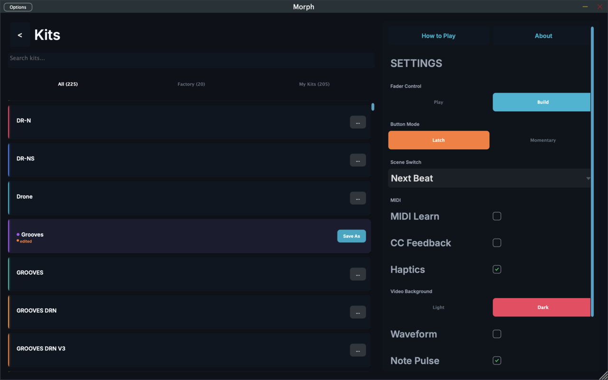
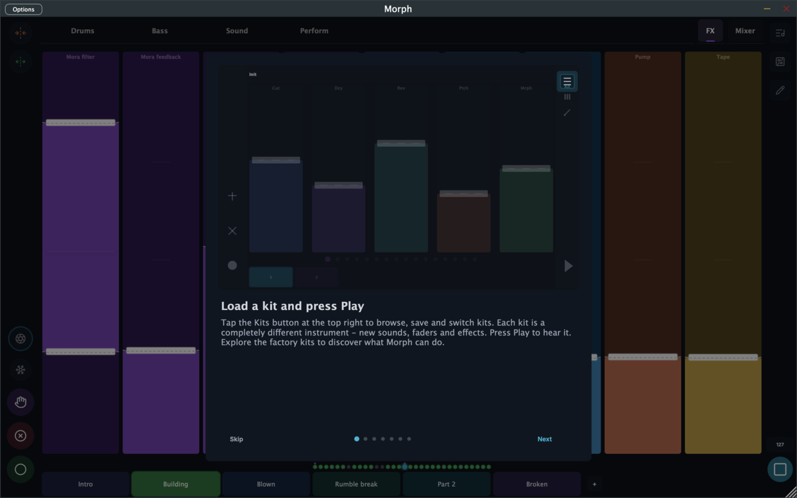

# Kits & Settings

Tap the **Kits button** (list icon, top-right of the stage) to open the Kits screen — kit browser on the left, settings on the right.

---

## The kit browser

A **kit** is everything: devices, wiring, fader pages, mappings, motion recordings, scenes, tempo. Kits save as `.morph` files.

- **Search** by name, and filter with the **All / Factory / My Kits** tabs.
- **Tap a kit** to load it. If your current kit has unsaved changes, Morph asks first.
- The **current kit** is highlighted and shows an orange **edited** dot when modified, plus inline buttons:
  - **Save** — overwrite (your own kits only)
  - **Save As** — save a copy under a new name (the only way to "save" a factory kit)
  - **Delete** — with confirmation
- The **"…" menu** on other kits offers extras like merging a kit into the current one.
- Kits based on a factory kit show a "Based on" subtitle so you can trace lineage.

### Sharing kits

At the bottom of the settings column:

- **Export Kit** — saves the current kit as a `.morph` file to share (AirDrop, Files, anywhere)
- **Import Kit** — load a `.morph` file someone sent you

Exported kits are self-contained — sounds, layouts, patterns, scenes, everything.

---

## Settings

The right-hand column, top to bottom:

| Setting | Options | What it does |
|---------|---------|--------------|
| **Fader Control** | Play / **Build** | Build (default): faders stay where you leave them; HOLD suspends saving. Play: faders spring back to saved position on release; HOLD commits instead. Play mode is the live-performance scheme. |
| **Button Mode** | **Latch** / Momentary | Whether REC/HOLD/CLEAR toggle on tap, or are active only while held. |
| **Scene Switch** | Next 16th / Next Beat / Next Bar / Next 2 Bars / Next 4 Bars / End of Pattern | The musical boundary scene switches wait for while playing. (Switches are instant when the transport is stopped.) |
| **MIDI Learn** | toggle | Enter mapping mode for external controllers — see [MIDI](midi.md). |
| **CC Feedback** | toggle | Send fader positions back out as MIDI CC, for motorized faders and LED rings — see [MIDI](midi.md). |
| **Haptics** *(iOS)* | toggle | Tactile feedback on fader touches, section borders, and detents. |
| **Video Background** | Light / Dark | Background for jam video recordings. |
| **Video Orientation** *(iOS)* | Vertical / Horizontal | Aspect for jam videos (vertical for Reels/TikTok). |
| **Waveform** | toggle | Live waveform scope overlaid across the stage. |
| **Note Pulse** | toggle | Faders flash when their sequencer fires a note. |

Two more buttons live at the top of the settings column:

- **How to Play** — the built-in 7-card interactive tutorial:

- **About** — version info and credits for the open-source DSP Morph stands on (Mutable Instruments Plaits, Open303, DaisySP, Airwindows, WeirdDrums).

---

## Morph in a DAW

Morph also runs as a plugin — VST3 on macOS, AUv3 on iOS. In a host:

- Tempo and transport follow the DAW; the BPM dialog shows "Synced to host."
- The full kit state is stored with your DAW session, independent of saved kit files.
- Jam video recording is standalone-only.
