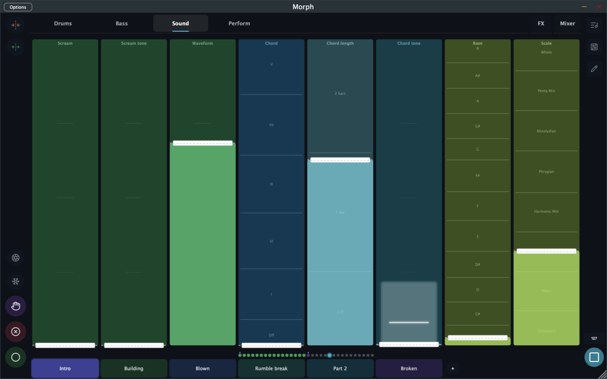
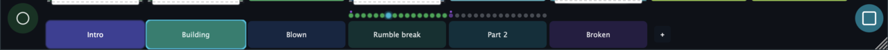

# Morph: Quick Start

Morph is a music app where you move sliders — called **faders** — to control sounds in real time. The twist: Morph can record your movements and loop them back, so you can layer up a performance one gesture at a time.

Here's how to make something in five minutes.

---

## 1. Load a kit and press Play

Tap the **Kits button** (the list icon in the top-right corner) to open the kit browser, and pick any factory kit. Then tap **Play** (bottom-right corner).

You should hear something immediately — most kits start with sequencers running. The faders on screen will begin moving on their own, playing back pre-recorded patterns.

## 2. Touch a fader

Drag any fader up or down. It controls a parameter — a filter, a pitch, a reverb level, whatever the kit is wired to. The fader stays where you leave it.

You don't need to know what each fader does to start experimenting. Move things and listen.

## 3. Record a movement

Tap **REC** (the circle button at the bottom-left) to activate it — it latches, no need to hold. Now touch and move a fader. Morph records everything you do. Tap REC again to stop.

On the next loop, Morph plays your movement back exactly as you made it. Tap REC again and record something on a different fader. Movements stack.

## 4. Clear a fader

Tap **CLEAR** (the ⊗ button), then touch any fader to erase its recorded movement. The fader holds its current position. Tap CLEAR again when you're done.

## 5. Switch scenes

The row of buttons at the bottom are **scenes** — each one is a different snapshot of fader positions and recordings. Tap a scene to switch. Tap **`+`** to duplicate the current scene and start building a variation.

This is how you create arrangement: different scenes for different parts of the track, switching between them live.

---

## Save your work

Open the **Kits** screen (list icon, top right). Your current kit is highlighted — tap **Save As** to save your own copy. Factory kits stay untouched; your version lands in **My Kits**.

---

## Built-in tutorial

Morph ships with a short interactive walkthrough: open the Kits screen and tap **How to Play** in the top-right. Seven cards cover everything on this page with animations.

---

## What else is in here

Morph has a lot more under the hood. Once you're comfortable with the basics:

- **Pages** — organize faders across multiple named tabs ([Full Guide](intro.md))
- **HOLD** — audition fader moves without committing them
- **Time Jump** — retroactively capture a movement you liked but didn't record
- **Freeze** — enter freeze mode, then tap a fader's snowflake to lock just that fader while the rest keep moving
- **The Board** — a full signal-flow view where you can see and rewire how sequencers, synths, effects, and modulators connect ([The Board & Routing](board.md))
- **Modulators** — LFOs and envelopes that move faders automatically ([Sounds & Modulators](devices.md))
- **Sequencers** — Euclidean rhythms, generative melodies, and a full chord progression engine ([Sequencers](sequencers.md))

The [Full Guide](intro.md) covers the performance surface in detail.
