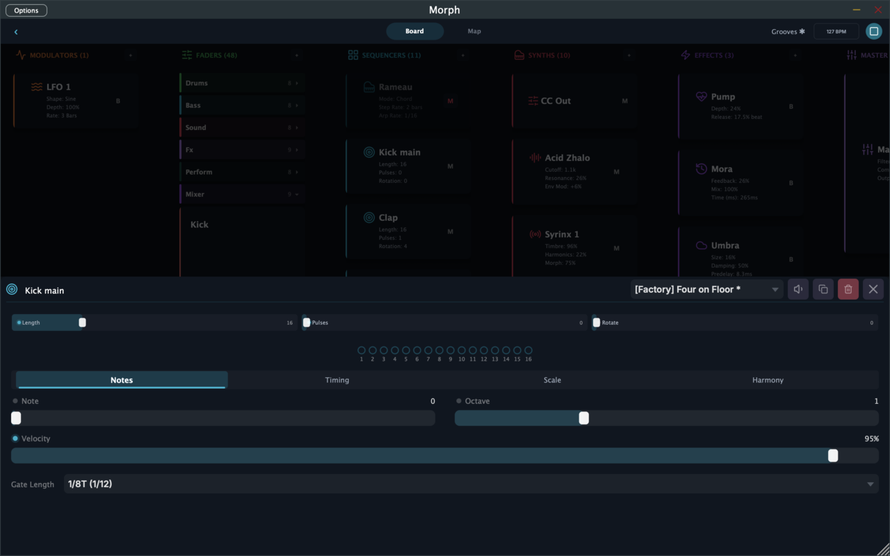
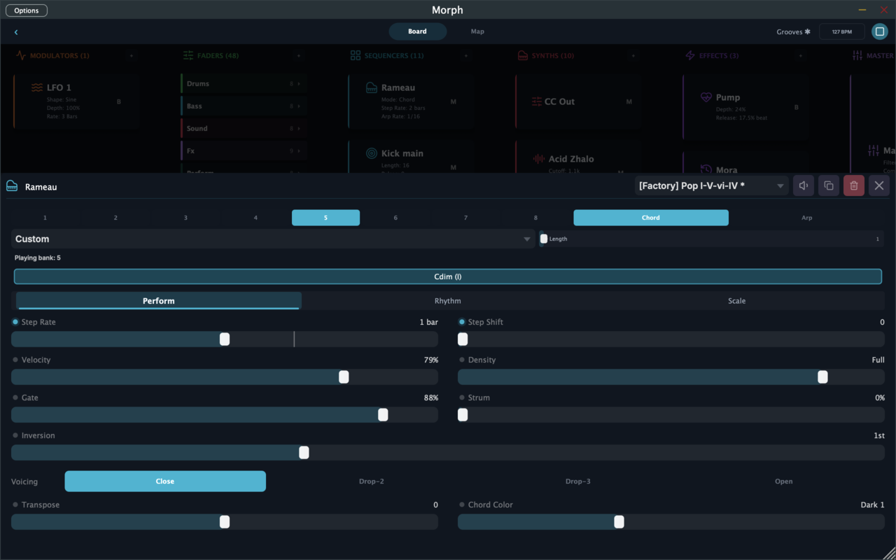

# Sequencers

Sequencers are the pattern engines of Morph. They generate MIDI notes in sync with the transport and send them to synths (or out to hardware via MIDI Out). A kit can run many sequencers at once — a typical groove kit has one per drum voice plus one or two melodic ones.

You create and wire sequencers on the [Board](board.md), and edit them by tapping their card:

Two things all four sequencer types share:

- **Scale awareness** — melodic sequencers quantize to a scale and root, so wrong notes aren't really possible.
- **Chord following** — any sequencer can follow the **harmonic leader** (usually a Rameau chord sequencer). When the chord changes, followers re-pitch to match. One progression, whole kit in harmony.

---

## Euclid — rhythm sequencer

The Euclidean algorithm distributes a number of hits as evenly as possible around a loop — a surprisingly deep idea that generates everything from four-on-the-floor to Afro-Cuban bell patterns to broken techno.

Three controls do most of the work:

- **Length** — how many steps in the cycle (1–64)
- **Pulses** — how many of them are hits
- **Rotation** — shifts the pattern around the circle

Length 16, pulses 4 → a steady kick. Pulses 5 → instantly funkier. Rotate by 2 → the same rhythm, off the grid.

Beyond the pattern: note, octave, velocity, and gate length; a **clock division** for the step rate (from 1/128 through dotted and triplet values up to 8 bars); and **ratchets** — per-step rapid retriggers for fills and rolls.

In factory kits, drum faders are often mapped to a Euclid's **Pulses** — push the fader up and the pattern gets busier. That's the magic behind "one fader = more drums."

## Trigger — touch-to-play sequencer

Trigger turns faders into playable instruments. Instead of running a fixed pattern, it fires notes **while a fader touch enables it** — typically wired so that grabbing a fader starts a pulse of notes and releasing stops it.

You shape the result with:

- **Pulse Rate** — the note grid (musical divisions)
- **Gate Mode** — retrigger each pulse, sustain while held, or one-shot
- **Start Mode** — quantized to the grid or free
- **Pitch controls** — fixed note, transpose, octave span, or arpeggio patterns that follow the harmonic leader

It's the device behind "performance" faders where touching the fader *is* the riff.

## Turing — generative sequencer

A mutating pattern machine inspired by Turing Machine-style shift registers. It plays a looping melody that **evolves under your control**:

- **Mutation** — the big one. At 0 the pattern is locked and loops forever. At 0.5, about half the notes change each pass. At 1.0 the melody never repeats.
- **Density** — how many steps actually sound
- **Length** — pattern length
- **Algorithm** — six flavors of generation: standard scale notes, arpeggio runs, chord tones, call-and-response, sequential scale walks, and "jarreth" (melody-only below 50% mutation, melody + rhythm above)

Because Turing stores notes as scale degrees, changing scale, root, or the followed chord re-pitches the existing melody instead of regenerating it — the pattern survives, the harmony moves.

Map a fader to Mutation and you can ride the line between loop and chaos live. (Factory kits label that fader things like "Evolve" or "Mangle notes.")

## Rameau — chord sequencer

Rameau is the harmonic brain of a kit. It plays chord progressions and **publishes the current chord** so every following sequencer stays in key.

How it's organized:

- **8 banks**, each holding a progression. Tap a bank to queue it; switches land on the next step boundary.
- **Progression templates** — a library of classics to start from (Andalusian cadence, pop I–V–vi–IV, etc.), or build your own.
- **Chord / Arp modes** — play progressions as held chords or break them into arpeggios with rate, pattern, and octave-range controls.

And the performance controls, all fader-mappable:

- **Density** — from sparse root notes up to full voicings
- **Inversion & Voicing** — root through 3rd inversion; close, drop-2, drop-3, or open spacing
- **Strum** — humanized roll across the chord
- **Chord Color** — darkens or brightens the chord *quality* itself (not a transpose) — minor-ward or major-ward shading in real time
- **Step Rate / Step Shift** — how fast the progression advances, and rhythmic rotation
- **Rhythm tab** — a Euclidean retrigger layer that re-strikes the held chord in patterns

A typical setup: Rameau plays pads through a Syrinx, while a Turing follows it for a melody and a Trigger arpeggiates it on touch. Change one chord in Rameau and the entire kit follows.

---

## Sequencer clocking

Every sequencer (and the delay) shares one canonical division table — thirty values from 1/128 to 8 bars including dotted and triplet times — so polyrhythms between devices always line up. Global **swing** (set in the BPM dialog) shifts off-beat 16ths across all sequencers at once.
